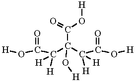
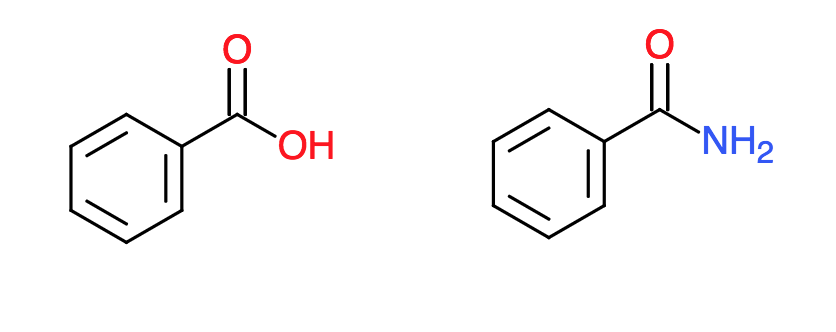
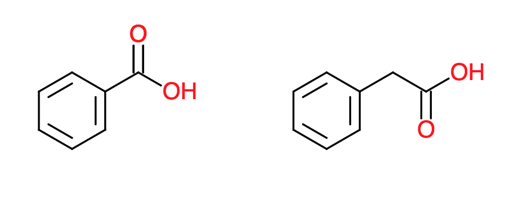

# New Drug Development Rules {#drug-rules}

#### Keywords

medicinal, chemistry, pharmaceutical, drug, development, rules,

## The Exorbitant Cost of Drug Development

Pharmaceutical drugs are a cornerstone of modern medicine.
They are important treatments for many infectious diseases, psychiatric disorders, cancers, diabetes, cardiovascular problems, autoimmune diseases, and more.
The problem is the enormous cost of research and development in new drugs, which has gotten worse in the 21st century.
In 2014, it was reported to cost about $2.6 billion to get a new drug on the market—double the cost from 10 years ago (145% increase when adjusted for inflation). [@drug-cost]
Most of these costs are incurred during the clinical trials, where drugs are vetted for efficacy and safety in humans, and during pre-clinical research, where the drug's structure and function are optimized in order to pass clinical trials.
Despite these efforts, only about 1 in 10 drugs to enter clinical trials ever get approved. [@drug-approval]

To give drugs the best possible chance of passing clinical trials, chemists have developed various design principles to use during the optimization process. One of the most widely used principles is [Lipinski's Rule of Five](https://en.wikipedia.org/wiki/Lipinski%27s_rule_of_five).
Lipinski's Rule was formulated in 1997.
By following it, chemists increase their chances of producing drug candidates with favorable [pharmacokinetic properties](https://en.wikipedia.org/wiki/Pharmacokinetics).
This helps reduce the "chemical space," or the set of possible molecules that need to be explored as potential candiates, reducing the number of experiments needed and the costs in turn.

In the past 20 years, new innovations in computing power and machine learning have come forth that provide promising avenues for finding new, more complex rules.
Machine learning models can be trained to classify favorable pharmacophores with higher fidelity by leveraging lots of existing data on drugs and drug candidates.
Such a tool can further aid the preclinical research and reduce costs.
Additionally, more highly optimized candidates might be identified, increasing the likelihood of FDA approval.

## Models for Recognizing "Drug-likeness"

Machine learning models can learn complex, non-linear trends in order to classify numerical inputs.
The goal is to classify potential drug candidates as having favorable or unfavorable pharmacokinetics.
Existing data will be used on drugs and drug candidates to train various types of models to predict pharmacokinetic favorableness, or "drug-likeness".
Models to evaluate include logistic classifiers, random forests (decision trees), and neural networks.
These models require numerical data as input. Molecules are not easily represented as vectors, as they comprise a graph of bonds between different non-ordinal atomic identities in distinct 3D structures.
Some methods will also be explored to approximate or capture specific molecular features as matrices.

#### Structural Matrix

An organic molecule's carbon skeleton is often the primary influence for its 3D shape.
We can represent a carbon chain by placing the carbons as rows and columns in a matrix, $A$ and having the bond order between carbon $i$ and $j$ occupy the cell in $A_{i,j}$

```{r echo=FALSE, out.width='30%'}

```

For example, Citric Acid would have the following bond matrix:

$$A = \begin{bmatrix}
0 & 1 & 0 & 0 & 0 & 0 \\ 
1 & 0 & 1 & 0 & 0 & 0 \\
0 & 1 & 0 & 1 & 0 & 1 \\
0 & 0 & 1 & 0 & 1 & 0 \\
0 & 0 & 0 & 1 & 0 & 0 \\
0 & 0 & 1 & 0 & 0 & 0
\end{bmatrix}$$

#### Functional Group Vector

Another possible numerical representation could be the [functional groups](https://en.wikipedia.org/wiki/Functional_group) present in the molecule.
In a similar manner to the [Bag-of-words Model](https://en.wikipedia.org/wiki/Bag-of-words_model) in Natural Language Processing, each functional group in a corpus of moecules could be assigned an index number.
For example:

  1. Carboxylic acid
  1. Ketone
  1. Aromatic Ring
  1. Alcohol
  1. Amide

By assigning various indices to function groups of interest, the presence and multiplicity of those functional groups can be encoded in the vector. Citric Acid, for example, would be represented as $[\ 3\ 0\ 0\ 1\ 0\ ...\ ]$.

#### Other Possible Representations

Things like the electrical dipoles, locations of electron pairs, and other molecular features could be encoded as matrices.


## Capabilities of the Model

The aforementioned matrix representations are all **lossy**.
No single representation can be used to find the original chemical structure.
As such, Benzamide and Benzoic acid have the same structural matrix...

```{r echo=FALSE, out.width='30%'}

```

whereas Benzoic Acid and Phenylacetic Acid have the same functional group vector.

```{r echo=FALSE, out.width='30%'}

```

These clashes of information can lead to degradation of the predication accuracy.
However, since Lipinski's rules make predictions from scalar quantities, like weight and solubility, matrices and vectors contain more information.
These models can therefore be expected to perform well when compared with the current standards.
There remain other potential sources of error, as there are complexities not captured by the encodings.
Among them are actual 3D conformations, affinity for *in vivo* metabolic proteins, and the shapes and energies of the molecular orbitals.

There is a bias in the data.
Due to the historical prevalence of Lipinski's rules, chemists tend to make molecules that are compliant with these rules.
As a result, the data disproportionately represents molecules that conform to those rules, causing a favoritism for those molecules already supported by the existing rules.
In effect, there is a lack of "exploration".
The model has not seen enough examples of radically different molecules in order to find broader patterns.
The model has basically re-learned the same rules.
In order to combat this, some existing examples might need to be downsampled and more data collected.

## Conclusion

By exploring the various ways to encode molecules as vectors and matrices, they became eligible as inputs for machine learning.
Several representations including structural, dipolar, and functional information enabled classifiers to select promising candidates for drug optimization.
These models can enable medicinal chemisty researchers to more judiciously choose which analogs to synthesize and test for drug efficacy.
Such insights reduce the number of experiments that have to be conducted, bring down costs, and increase the likelihood of clinical trial success.


