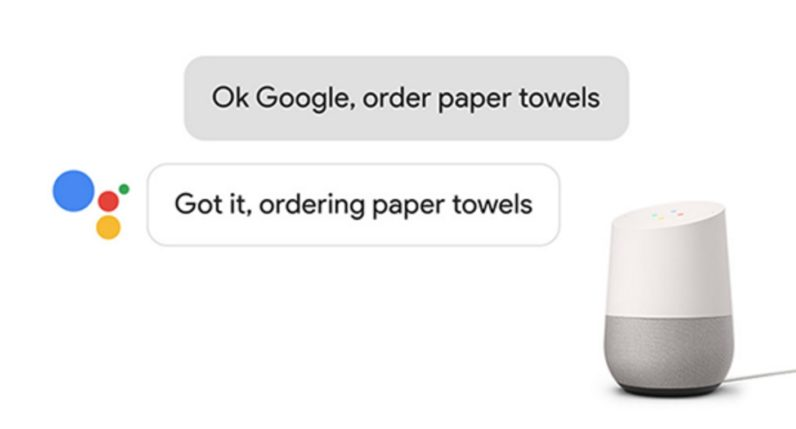

# Humanoid Virtual Assistant {#morgan-freeman-assistant}

#### Keywords {-}

human, virtual, sales, assistant, retail, generative, neural, network

## Finding a New Retail Paradigm

Retailers are constantly seeking and experimenting with advancements in commerce to attract customers.
E-commerce [@sales-census] (using the internet as a platform for buying and selling products and services) has fundamentally changed the competitve landscape and helped enable Amazon.com to beat the classic big-box retailers like Walmart and Target. [@holiday-market-share]

```{r echo=FALSE, out.width='50%', fig.align="center"}
knitr::include_graphics('./img/amazon-sales.jpeg')
```

One emergent e-commerce technology is the home virtual assistant, a device that uses a natural language interface.
You can command them with your voice in your natural language, as if you were speaking to another human (sort of).
Incarnations of this idea include the Amazon Echo and Google Home.
These devices do more than just tell you the weather and manage your calendar - you can give them a credit card and then ask them to make purchases for you—from things like shaving cream, to pizza, and even plane tickets.

```{r echo=FALSE, out.width='50%', fig.align="center"}

```

The virtual assistant platform has incredible potential to drive engagement with retailers,
but consumers have been slow to warm to them.
In order for adoption to increase, the user experience is of paramount importance.

We can look to other tech platforms for ideas on how to increase engagement. Users are drawn to the faces and voices of people, especially those that are familiar.
On the Facebook news feed, people are more likely to view a post if it contains emojis or pictures/videos of people. [@facebook-algorithm]
In a similar manner, we hypothesize that users will engage more with a personal assistant with a human face and voice - an experience akin to a human conversation.
This builds upon the virtual assistant's natural language interface and makes them *natural conversations*.
To create realistic simulations of humans, we can utilize a class of **generative** machine learning models.
By implementing humanoid voice assistants, we can drive up user engagement with virtual assistant devices and ultimately increase sales revenue.


## Generative Machine Learning

A key milestone to improving the user experience of virtual assistants is to enhance their interactions with realistic faces and voices.
In order to do this, we can use a class of machine learning models called [Generative Adversarial Networks](https://en.wikipedia.org/wiki/Generative_adversarial_network#cite_note-1) (GAN), proposed in 2014. [@GANs]
GANs are unsupervised models that can create new, authentic-looking data based on training examples.
This technique has already been used to create [videos of speeches from President Obama](https://www.theverge.com/2017/7/12/15957844/ai-fake-video-audio-speech-obama). [@obama]
Generative techniques can be used to project facial movements from any *source actor's* face onto a *target actor*,
like President Donald Trump or Vladimir Putin, demonstrated [here](https://www.theverge.com/2016/12/20/14022958/ai-image-manipulation-creation-fakes-audio-video). [@trump]

We can use these techniques to create an audio/video-based assistant to run on a consumer's home device or mobile phone.
Since abundant, good quality video data are required for training,
prominent movie or TV stars would be ideal targets as there are many hours of high-resolution video footage of them to train on.
Models for various types of actors will be trained: males and females, young and old, even good and evil.
(Actors like Morgan Freeman would be considered more "good" than Christopher Walken because Walken seems to always play the villain.)

## Validating the Models

After the GANs optimize the data generation, the videos must be accepted by humans.
If actual people find the simulations too unrealistic or "creepy," the product is doomed to fail.
Subjects will be shown several video clips of the real actors and the simulated ones without knowing which is which.
After viewing the clips, they will be asked several questions about the clips.
"Did any of those videos seem fabricated? If so, which ones? Was there anything off-putting about any of the clips?"
If the models are accepted, that is, they cannot be distinguished from the real actors with high fidelity, then they can be deployed.

## Deploying the Models

At this point, the goal is to determine if these models can increase engagement and in turn increase sales.
A cohort of beta testers can be recruited to try a new virtual home assistant featuring integrations with online stores like Amazon.com.
One device, the control group, would have a traditional assistant like the Amazon Echo Dot.
The others will get the humanoid assistant with a video screen that shows the simulated actor.
Based on the data collected from each interaction and transaction,
we can examine if the users with the humanoid assistant had more engagement.

**Note:** Consent shall be required to use any model created out of the likeness of any human before using it in production.

## Future Work

If this approach shows feasibility, there are many avenues for further optimization.
Apart from Morgan Freeman, which types of actors should be shown?
Are some actors going to be more favored by certain demographics of consumer?
Can other sensors be used other than just the microphone listening to the users' words?
Perhaps an infrared face scanner, similar to the technology slated for the iPhone X,
could be used to gauge the users' reactions from their facial expressions (which may differ from what they **say**)?


## Conclusion

In-home virtual assistants offer significant potential gains for retailers by executing purchases based on natural language. 
By evolving natural language into natural conversations, which uses a simulation of a human face and voice, we can improve the user experience of these devices and drive sales online.
