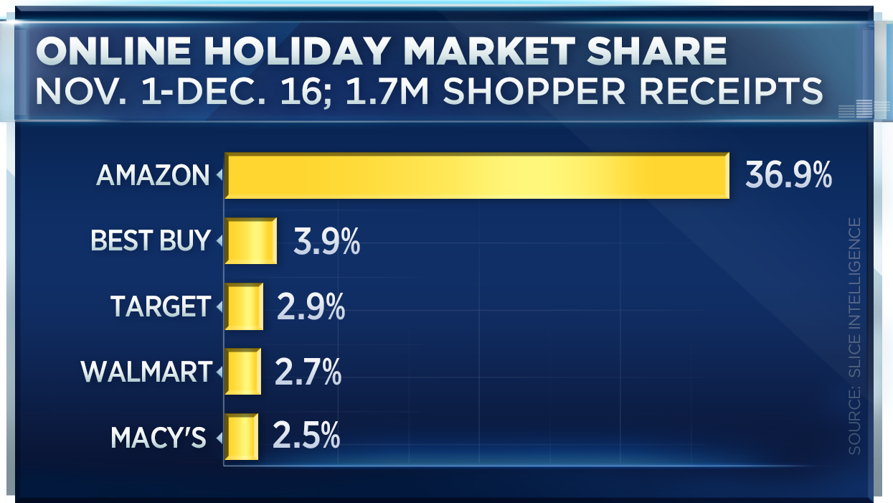
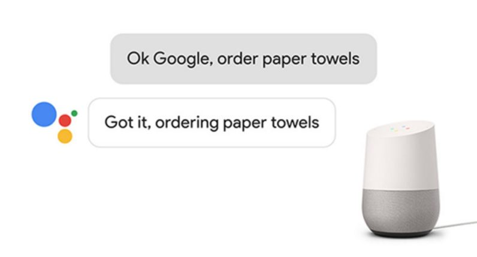

# Humanoid Virtual Assistant {#morgan-freeman-assistant}

#### Keywords

human, virtual, sales, assistant, retail, generative, neural, network

## Finding a New Retail Paradigm

Retailers are constantly seeking and experimenting with advancements in commerce to attract customers.
One of the most salient of advancements in past couple of decades is e-commerce, using the internet as a platform for buying and selling products and services.
E-commerce now comprises hundreds of billions of dollars each quarter in the U.S. retail market. [@sales-census]
Another innovation is importance of data-driven decision-making.
Putting data analysis at the center of the organization and using its insights to augment logistics, culture, and processes will enable businesses to extract more value and provide the customer better products for lower costs. [@competing-analytics]
It's innovations like these that enable Amazon.com to beat big box retailers like Walmart and Target. [@holiday-market-share]

```{r echo=FALSE, out.width='50%', fig.align="center"}

```

The purpose of this project is to explore how recent advancements in big data, machine learning, and mobile computing
can further increase the engagement and convenience of online retail, just as the internet heralded the shift to e-commerce.
One emergent technology along these lines is the home virtual assistant, devices that use a "natural language" interface.
You can command them with your voice in your natural language, as if you were speaking to another human (sort of).
Incarnations of this idea include the Amazon Echo, Google Home, and the Apple HomePod.
These devices do more than just tell you the weather and manage your calendar.
You can give them a credit card and then ask them to make purchases for you—from things like shaving cream, to pizza, and even plane tickets.
```{r echo=FALSE, out.width='50%', fig.align="center"}

```
The virtual assistant platform has incredible potential to drive engagement with retailers, as they can provide ancillary services like maintaining your shopping list and alerting you when prices or fares drop.
Given the enough data, and perhaps your mother's Facebook page, it might be able to recommend a good Christmas gift for her.
These devices have yet to rise to preeminent adoption.
For now it remains a highly promising avenue for customer interaction.

In order for the virtual assistant platform to live up to this promise, the user experience is of paramount importance, and the details matter.
Is the average consumer really going to enjoy talking to a disembodied, robotic voice?
What improvements can be made to increase adoption?
We can look to other tech platforms for ideas on how to increase engagement.
For example, on the Facebook news feed, people are more likely to view a post if it contains emojis or pictures/videos of people. [@facebook-algorithm]
Users are drawn to the faces and voices of people, especially those that are familiar.
In a similar manner, we hypothesize that users will engage more with a personal assistant with a human face and voice—an experience akin to a human conversation.
This builds upon natural language interfaces and makes them *natural conversations*.
To create realistic simulations of humans, we can utilize a class of **generative** machine learning models.
Herein we propose methods for implementing and testing humanoid voice assistants with the goals of driving up user engagement and sales revenue.


## Generative Machine Learning

We believe a milestone in achieving a better user experience for virtual assistants is to enhance their interactions with realistic faces and voices.
In order to do this, we can use a class of machine learning models called [Generative Adversarial Networks](https://en.wikipedia.org/wiki/Generative_adversarial_network#cite_note-1) (GAN), proposed in 2014. [@GANs]
GANs are an unsupervised learning algorithm that comprises two models, one that learns to recognize data from a given distribution, and another that learns to produce data to trick the other model into thinking it came from that same distribution. For example, one model could be trained to recognize a [Common Redshank](https://en.wikipedia.org/wiki/Common_redshank), and the other can be trained to *create* new images of them with the first model telling it how well its doing.

```{r echo=FALSE, out.width='30%', fig.cap="Generated images of Redshanks (http://yosinski.com/ppgn)"}

```

This technique has already been demonstrated to create videos of speeches from President Obama. [@obama]
Generative techniques can be used to project facial movements from any *source actor's* face onto a *target actor*, like as President Donald Trump or Vladimir Putin, demonstrated [here](https://www.theverge.com/2016/12/20/14022958/ai-image-manipulation-creation-fakes-audio-video). [@trump]
We can use these techniques to create an audio/video-based assistant resembling a familiar figure. These videos would be generated instantly during conversation on their home device or smartphone to convey the responses from the virtual assistant.
They can be entirely adaptive, dynamic, and computationally generated thanks to machine learning.
Since abundant, good quality video data are required for training, prominent Movie or TV stars would be ideal targets as there are many hours of high-resolution video footage of them to train on.
Models for various types of actors will be trained: males and females, young and old, good and evil (we assume actors like Morgan Freeman would be considered more "good" than Christopher Walken because Walken seems to always play the villain).

## Validating the Models

After the GANs optimize the data generation, the videos must be accepted by humans.
If actual people find the simulations too unrealistic or "creepy," the experiment is doomed to fail.
Subjects will be shown several video clips of the real actors and the simulated ones without knowing which is which.
After viewing the clips, they will be asked several questions about the clips.
"Did any of those videos seem fabricated? If so, which ones? Was there anything off-putting about any of the clips?"
If the models are accepted, that is, they cannot be distinguished from the real actors with high fidelity, then they can be deployed.

## Deploying the Models

At this point, the goal is to determine if these models can increase engagement and in turn increase sales.
A cohort of "beta testers" can be recruited to try a hypothetical new virtual home assistant featuring integrations with online stores like Amazon.com.
One device, the control group, would have a traditional assistant like the Amazon Echo Dot.
The others will get the humanoid assistant with a video screen that shows the simulated actor.
Based on the data collected from each interaction and transaction, we can examine if the users with the humanoid assistant had more engagement.

**Note:** Consent shall be required to use any model created out of the likeness of any human before using it in production.

## Future Work

If this approach shows feasibility, there are many avenues for further optimization.
Apart from Morgan Freeman, which types of actors should be shown?
Are some actors going to be more favored by certain demographics of consumer?
Can other sensors be used other than just the microphone listening to the users' words?
Perhaps an infrared face scanner, similar to the technology slated for the iPhone X,
could be used to gauge the users' reactions from their facial expressions (which may differ from what they **say**).


## Conclusion

We have discussed the need to utilize modern technologies to innovate the customer interfaces in e-commerce.
One promising technology is to evolve natural language interfaces into natural conversations, which involve a simulation of a human face and voice.
We describe the generative algorithms that could produce candidates for such a virtual assistant.
This lays the groundwork for testing interfaces that improve sales online.
